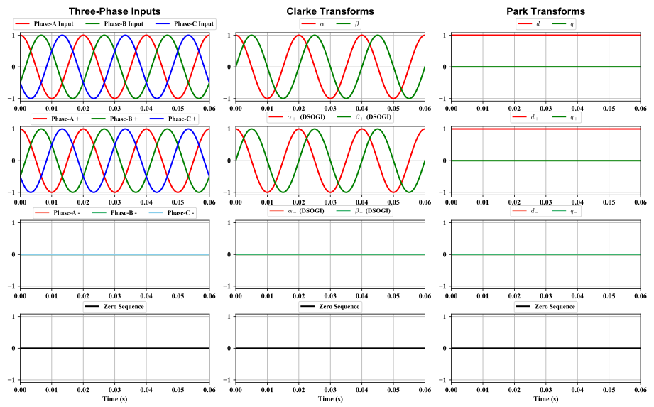

# Interactive Visualisaion for Symmetrical Components (Fortescue, Clarke and Parke)

The purpose of this project is to dynamically visualise all the three-phase symmetrical components. 
This includes the following definitions for symmetrical components: 

* The orginal definition proposed by **Fortescue**, which is at its centenary this year (2018)
* Symmetrical components for the **Clarke Transform** (amplitude invariant), according to the DSOGI
* Symmetrical components for the **Park Transform**, calculated from the DSOGI Clarke Transform symmetrical components

This project would allow the user to define the three-phase inputs and the PLL angle to allow studies of
different situations.

This project would provide the plots in both the time-domain and the polar-domain.

This project would allow the user to export the plots in various formats.

This project would allow the user to export the raw data in CSV.

This project would save user-defined inputs automatically in an INI file.

The GUI of this project is built with Qt designer.


## Version

0.1.0

This version is stable but not final.

## Getting Started

Type the following in your terminal:

```python
    python gsySymmMain.py
```

This should let Python to run the main script.

Or, you might need the following:

```python
    python3 gsySymmMain.py
```

### Prerequisites

* **asteval**
* **csv**
* **Python 3.5+**
* **maplotlib**
* **numbers**
* **numpy**
* **PyQt5**
* **tkinter**
* **time**
* **os**
* **sys**
* **glob**

[Anaconda](https://www.anaconda.com/download/) 5.0.1 should have everything.

I tried to make this project os independent, 
but since I only have a Windows machine, I have not been able to test it on any Linux systems.

### Installing

You must install Python first. And then download the whole master trunk to your local machine.

Make sure you have the following file:

* **gsySymmMain.py** - this is the main script
* **gsySymmAbout.py** - this is "About" window script
* **gsySymmEquations.py** - this is the image for the equations
* **gsySymmIcon.py** - this is the image for the "About" window
* **gsyPlt.py** - custom library for plotting
* **gsyIO.py** - custom library for IO
* **gsyINI.py** - custom library for INI file manipulations

Other files are mainly for automatic documentation generation via Sphinx.

Here are two useful links for using sphinx:

* [Sphinx Autodoc Tutorial for Dummies](https://codeandchaos.wordpress.com/2012/07/30/sphinx-autodoc-tutorial-for-dummies/)

* [Adding Numpydoc to Sphinx](https://codeandchaos.wordpress.com/2012/08/09/sphinx-and-numpydoc/)

A detailed how to use can be found in the [documentation](_build/html/index.html).

## Built With

* [Visual Studio Code](https://code.visualstudio.com/) - The main development tool
* [Spyder](http://pythonhosted.org/spyder/) - The secondary development tool
* [Anaconda](https://www.anaconda.com/download/) - The Python distribution used
* [Sphinx](http://www.sphinx-doc.org/en/stable/) - Used to automatically generate documentations
* [Read the Docs](https://github.com/rtfd/sphinx_rtd_theme) - The theme for Sphinx
* Windows 7 - The OS environment

## Preview

### GUI:


### Time-domain plots:


### Polar-domain plots:


## Contributing

**高斯羽 博士** (**Dr. GAO, Siyu**)

This project is out of personal interest mainly.

## Versioning

I use the GitHub web app and the built-in Git function of VS Code.

## License

This project is licensed under Apache 2.0 License - see the "LICENSE.md" file for details. 
But I would really hate it if any one want to use any of my code for commercial gain.

## Acknowledgments

* Charles L. Fortescue
* Edith Clarke
* Robert H. Park

## Special Thanks

**王文元 博士** (**Dr. WANG, Wenyuan**)