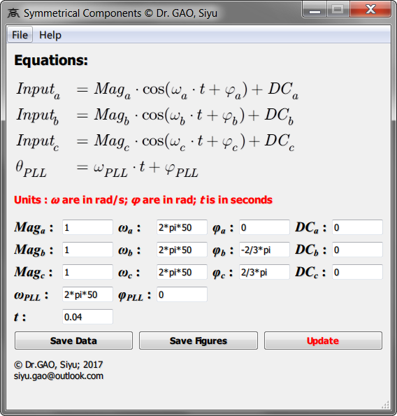
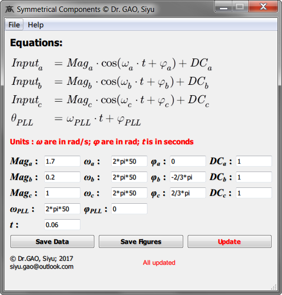
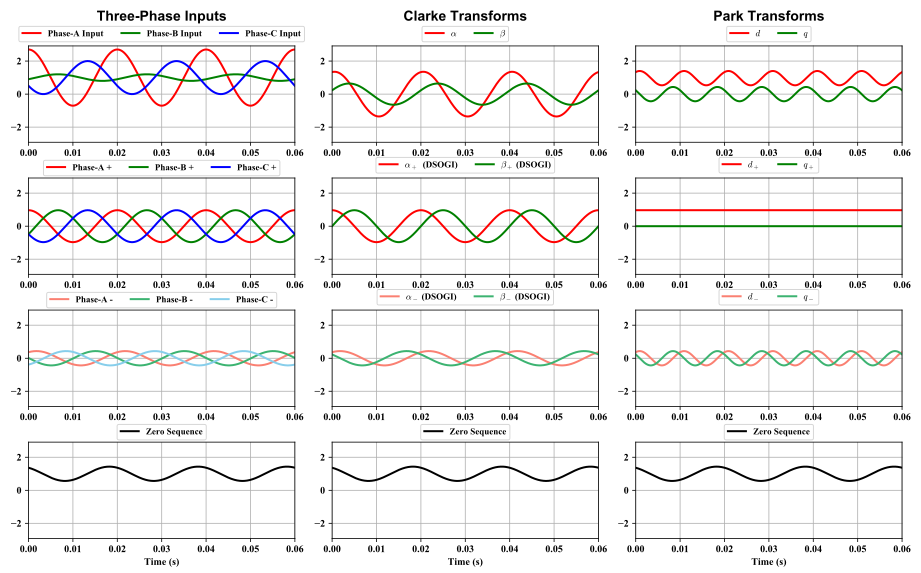
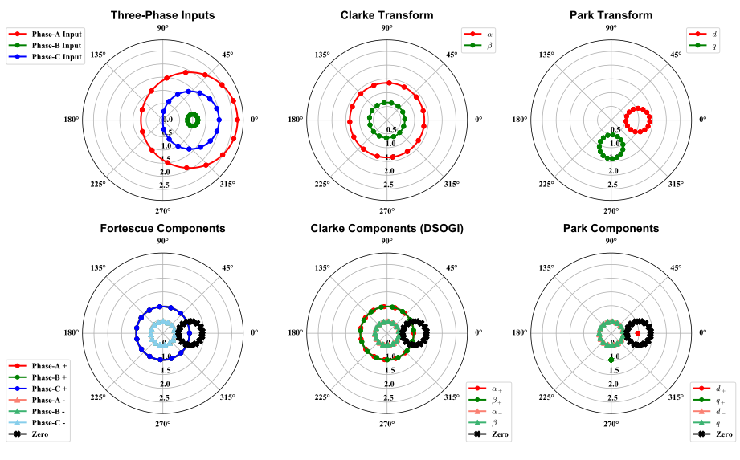
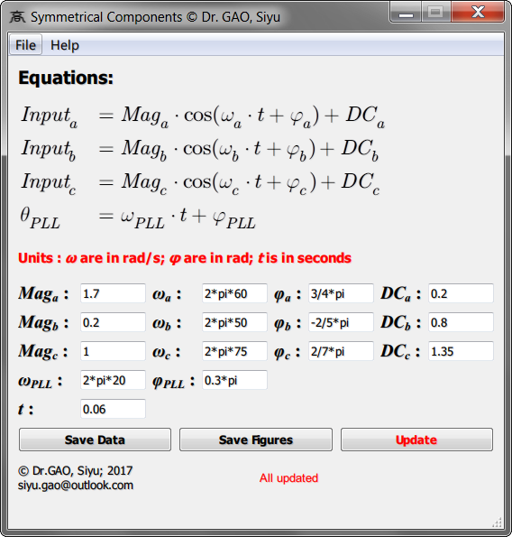
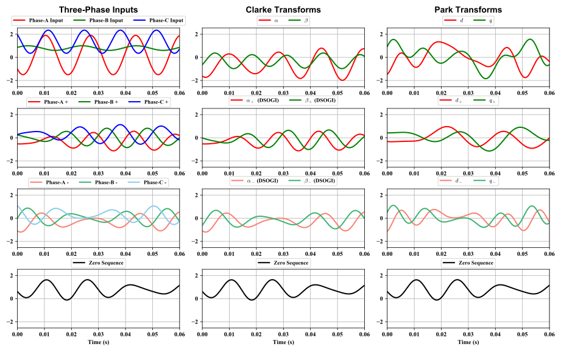
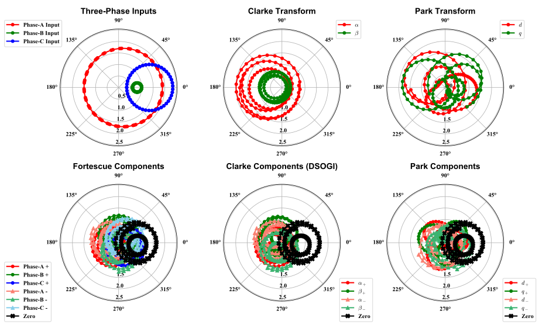

Introduction
=============
The purpose of this project is to dynamically visualise all the three-phase symmetrical components. 
This includes the following definitions for symmetrical components: 

* The orginal definition proposed by **Fortescue**, which is at its centenary this year (2018)
* Symmetrical components for the **Clarke Transform** (amplitude invariant), according to the DSOGI
* Symmetrical components for the **Park Transform**, calculated from the DSOGI Clarke Transform symmetrical components

This project would allow the user to define the three-phase inputs and the PLL angle to allow studies of
different situations.

This project would provide the plots in both the time-domain and the polar-domain.

This project would allow the user to export the plots in various formats.

This project would allow the user to export the raw data in CSV.

This project would save user-defined inputs automatically in an INI file.

The GUI of this project is built with Qt designer.

User-Defined Inputs
----------------------------------------
The following user-defined inputs are used to perform the calculations for the symmetrical components.

* `Three-Phase Inputs`_
* `PLL Angle`_

Three-Phase Inputs
^^^^^^^^^^^^^^^^^^^^^^^^^^^^^^^^^^^^^^^^^^^
.. math::
    \left[\begin{matrix}
    Input_a \\ Input_b \\ Input_c
    \end{matrix}\right] =
    \left[\begin{matrix}
    Mag_a \cdot \cos(\omega_a \cdot t + \varphi_a) + DC_a \\
    Mag_b \cdot \cos(\omega_b \cdot t + \varphi_b) + DC_b \\
    Mag_c \cdot \cos(\omega_c \cdot t + \varphi_c) + DC_c
    \end{matrix}\right]

===================== ============================================================
where:
===================== ============================================================
:math:`Input_a`         is the Phase-A input;
:math:`Input_b`         is the Phase-B input;
:math:`Input_c`         is the Phase-C input;
:math:`Mag_a`           is the magnitude of the Phase-A input;
:math:`Mag_b`           is the magnitude of the Phase-B input;
:math:`Mag_c`           is the magnitude of the Phase-C input;
:math:`\omega_a`         is the angular frequency of the Phase-A input;
:math:`\omega_b`         is the angular frequency of the Phase-B input;
:math:`\omega_c`         is the angular frequency of the Phase-C input;
:math:`t`               is the time;
:math:`\varphi_a`        is the initial phase of the Phase-A input;
:math:`\varphi_b`        is the initial phase of the Phase-B input;
:math:`\varphi_c`        is the initial phase of the Phase-C input;
:math:`DC_a`            is the DC bias of the Phase-A input;
:math:`DC_b`            is the DC bias of the Phase-B input;
:math:`DC_c`            is the DC bias of the Phase-C input.
===================== ============================================================

PLL Angle
^^^^^^^^^^^^^^^^^^^^^^^^^^^^^^^^^^^^^^^^^^^
.. math::
    \theta_{PLL} = \omega_{PLL} \cdot t + \varphi_{PLL}

====================== ===============================================================
where:
====================== ===============================================================
:math:`\theta_{PLL}`    is the PLL angle;
:math:`\omega_{PLL}`    is the angular frequency of the synchronous reference frame;
:math:`t`               is the time;
:math:`\varphi_{PLL}`   is the initial phase of the PLL angle.
====================== ===============================================================

Fortescue Transform (the original symmetrical components)
--------------------------------------------------------------------------------------
Define:

.. math ::

    A = e^{j \frac{2}{3} \pi} = \angle 120^{\circ}
    
Commonly, the lowercase of :math:`A` (capital :math:`\alpha`), is used. 
To avoid confusion with :math:`a` (/eɪ/), the uppercase, :math:`A`, is used here instead.

.. math ::

    \left[\begin{matrix} 
    a_{+} \\ b_{+} \\ c_{+}
    \end{matrix}\right] 
    &= \frac{1}{3} 
    \left[\begin{matrix} 
    1 & A & A^2 
    \\ A^2 & 1 & A
    \\ A & A^2 & 1 
    \end{matrix}\right] 
    \left[\begin{matrix} 
    a \\ b \\ c 
    \end{matrix}\right]

    \\

    \left[\begin{matrix} 
    a_{-} \\ b_{-} \\ c_{-}
    \end{matrix}\right] 
    &= \frac{1}{3} 
    \left[\begin{matrix} 
    1 & A^2 & A
    \\ A & 1 & A^2
    \\ A^2 & A & 1 
    \end{matrix}\right] 
    \left[\begin{matrix} 
    a \\ b \\ c 
    \end{matrix}\right]
    
    \\

    \left[\begin{matrix} 
    a_{Zero} \\ b_{Zero} \\ c_{Zero}
    \end{matrix}\right] 
    = \frac{1}{3} 
    \left[\begin{matrix} 
    1 & 1 & 1
    \\ 1 & 1 & 1
    \\ 1 & 1 & 1 
    \end{matrix}\right] 
    \left[\begin{matrix} 
    a \\ b \\ c 
    \end{matrix}\right]

===================== ============================================================
where:
===================== ============================================================
:math:`A`               is the :math:`120^{\circ}` shifter;
:math:`a`               is the Phase-A input;
:math:`b`               is the Phase-B input;
:math:`c`               is the Phase-C input;
:math:`a_+`             is the positive sequence of Phase-A input;
:math:`b_+`             is the positive sequence of Phase-B input;
:math:`c_+`             is the positive sequence of Phase-C input;
:math:`a_-`             is the negative sequence of Phase-A input;
:math:`b_-`             is the negative sequence of Phase-B input;
:math:`c_-`             is the negative sequence of Phase-C input;
:math:`a_{Zero}`        is the zero sequence of Phase-A input;
:math:`b_{Zero}`        is the zero sequence of Phase-B input;
:math:`c_{Zero}`        is the zero sequence of Phase-C input.
===================== ============================================================

Clarke Transform (amplitude invariant and DSOGI)
--------------------------------------------------------------------------------------

The amplitude invariant Clarke Transform
^^^^^^^^^^^^^^^^^^^^^^^^^^^^^^^^^^^^^^^^^^

.. math::

    \left[\begin{matrix} \alpha \\ \beta \\ Zero \end{matrix}\right] =
    \frac{2}{3}
    \left[\begin{matrix}
    1 & -\frac{1}{2} & -\frac{1}{2} \\
    0 & \frac{\sqrt{3}}{2} & -\frac{\sqrt{3}}{2} \\
    \frac{1}{2} & \frac{1}{2} & \frac{1}{2} 
    \end{matrix}\right]
    \left[\begin{matrix}
    a \\ b \\ c
    \end{matrix}\right]
    
===================== ============================================================
where:
===================== ============================================================
:math:`a`               is the Phase-A input;
:math:`b`               is the Phase-B input;
:math:`c`               is the Phase-C input;
:math:`\alpha`         is the :math:`\alpha` component of the Clarke Transform;
:math:`\beta`          is the :math:`\beta` component of the Clarke Transform;
:math:`Zero`            is the :math:`Zero` sequnece component.
===================== ============================================================

The DSOGI Clarke Transform
^^^^^^^^^^^^^^^^^^^^^^^^^^^^^^^^^^^^^^^^^^

Define:

.. math ::

    quad = e^{-j \frac{1}{2} \pi} = \angle -90^{\circ}

Then:

.. math ::

    \left[\begin{matrix} 
    \alpha_+ \\ \beta_+ 
    \end{matrix}\right] =
    \frac{1}{2} 
    \left[\begin{matrix} 
    1 & -quad \\ 
    quad & 1
    \end{matrix}
    \right] 
    \left[\begin{matrix} 
    \alpha \\
    \beta
    \end{matrix}\right]

    \\

    \left[\begin{matrix}
    \alpha_- \\
    \beta_-
    \end{matrix}\right] =
    \frac{1}{2} 
    \left[\begin{matrix} 
    1 & quad \\ 
    -quad & 1
    \end{matrix}\right] 
    \left[\begin{matrix} 
    \alpha \\
    \beta
    \end{matrix}\right]

===================== ============================================================
where:
===================== ============================================================
:math:`quad`            is the :math:`-90^{\circ}` shifter;
:math:`\alpha`         is the :math:`\alpha` component of the Clarke Transform;
:math:`\beta`          is the :math:`\beta` component of the Clarke Transform;
:math:`\alpha_+`       is the positive sequnece of the :math:`\alpha` component;
:math:`\beta_+`        is the positive sequnece of the :math:`\beta` component;
:math:`\alpha_-`       is the negative sequnece of the :math:`\alpha` component;
:math:`\beta_-`        is the negative sequnece of the :math:`\beta` component.
===================== ============================================================

For more information of the DSOGI [#]_, see:

    .. [#] Teodorescu, R., Liserre, M., and Rodríguez, P., *Grid Converters for Photovoltaic 
        and Wind Power Systems*. 2011: John Wiley & Sons, Ltd. 

Park Transform
----------------------------------------

The original definition
^^^^^^^^^^^^^^^^^^^^^^^^^^^^^^^^^^^^^^^^

.. math::
    \left[\begin{matrix} d \\ q \\ Zero \end{matrix}\right] =
    \left[\begin{matrix}
    \cos\theta & \sin\theta & 0 \\
    -\sin\theta & \cos\theta & 0 \\
    0 & 0 & 1
    \end{matrix}\right]
    \left[\begin{matrix}
    \alpha \\ \beta \\ Zero
    \end{matrix}\right]

===================== ============================================================
where:
===================== ============================================================
:math:`d`               is the :math:`d` component of the Park Transform;
:math:`q`               is the :math:`q` component of the Park Transform;
:math:`Zero`            is the :math:`Zero` sequence;
:math:`\theta`          is the SRF angle in radians;
:math:`\alpha`          is the :math:`\alpha` component of the Clarke Transform;
:math:`\beta`           is the :math:`\beta` component of the Clarke Transform;
===================== ============================================================

DSOGI Park Transform
^^^^^^^^^^^^^^^^^^^^^^^^^^^^^^^^^^^^^^^^^^^^^^^^^^^^^^^^^^^^^^^^^^^^^^^^^^^^^

.. math ::

    \left[\begin{matrix} d_+ \\ q_+ \\ Zero \end{matrix}\right] =
    \left[\begin{matrix}
    \cos\theta & \sin\theta & 0 \\
    -\sin\theta & \cos\theta & 0 \\
    0 & 0 & 1
    \end{matrix}\right]
    \left[\begin{matrix}
    \alpha_+ \\ \beta_+ \\ Zero
    \end{matrix}\right]

    \\

    \left[\begin{matrix} d_- \\ q_- \\ Zero \end{matrix}\right] =
    \left[\begin{matrix}
    \cos\theta & \sin\theta & 0 \\
    -\sin\theta & \cos\theta & 0 \\
    0 & 0 & 1
    \end{matrix}\right]
    \left[\begin{matrix}
    \alpha_- \\ \beta_- \\ Zero
    \end{matrix}\right]

===================== =============================================================================
where:
===================== =============================================================================
:math:`d_+`             is the positive :math:`d` component of the DSOGI Park Transform;
:math:`q_+`             is the positive :math:`q` component of the DSOGI Park Transform;
:math:`d_-`             is the negative :math:`d` component of the DSOGI Park Transform;
:math:`q_-`             is the negative :math:`q` component of the DSOGI Park Transform;
:math:`Zero`            is the :math:`Zero` sequence;
:math:`\theta`          is the SRF angle in radians;
:math:`\alpha_+`        is the positive :math:`\alpha` component of the DSOGI Clarke Transform;
:math:`\beta_+`         is the positive :math:`\beta` component of the DSOGI Clarke Transform;
:math:`\alpha_-`        is the negative :math:`\alpha` component of the DSOGI Clarke Transform;
:math:`\beta_-`         is the negative :math:`\beta` component of the DSOGI Clarke Transform.
===================== =============================================================================

User Interface
----------------------------------------

The user interface is shown in the following figure. The plots will show when the "Update" button
is clicked.

User Configurations (input fields)
^^^^^^^^^^^^^^^^^^^^^^^^^^^^^^^^^^^^^^^^^^^

Type in the math expressions as how you would in a Python terminal. White spaces should not cause error.
Some keywords are case senstive, like "pi" cannot be typed as "PI", otherwise, it would be regonised as
other value and the results would be very funny.

This project uses the "asteval" package to perform evaluation of user-defined inputs.
Its documentation page is:
https://newville.github.io/asteval/

======================= =============================================================================
Input field             Description
======================= =============================================================================
:math:`Mag_a`           is the magnitude of the Phase-A input
:math:`Mag_b`           is the magnitude of the Phase-B input
:math:`Mag_c`           is the magnitude of the Phase-C input
:math:`\omega_a`        is the angular frequency of the Phase-A input
:math:`\omega_b`        is the angular frequency of the Phase-B input
:math:`\omega_c`        is the angular frequency of the Phase-C input
:math:`\varphi_a`       is the initial phase of the Phase-A input
:math:`\varphi_b`       is the initial phase of the Phase-B input
:math:`\varphi_c`       is the initial phase of the Phase-C input
:math:`DC_a`            is the DC bias of the Phase-A input
:math:`DC_b`            is the DC bias of the Phase-B input
:math:`DC_c`            is the DC bias of the Phase-C input
:math:`\omega_{PLL}`    is the angular frequency of the SRF
:math:`\varphi_{PLL}`   is the initial phase of the PLL angle
:math:`t`               is the maximum time (starts from time zero)
======================= =============================================================================

   
Button Definitions
^^^^^^^^^^^^^^^^^^^^^^^^^^^^^^^^

============ ================ =====================================================================================
Button       Shortcut           Description
============ ================ =====================================================================================
Save Data    Ctrl + Shift + S   |  Prompts a file save dialogue and allows the generated data
                                |  to be saved as CSV
Save Figures Ctrl + S           |  Prompts a file save dialogue and allows the generated 
                                |  figures to be saved in various formats
                                |  
                                |  Suffix "_time" would be added to the filename for the 
                                |  image for time-domain
                                |  
                                |  Suffix "_polar" would be added to the filename for the 
                                |  image for polar-domain
Update       Ctrl + U           |  Updates the data according to the user-defined inputs 
                                |  and then update the plots
============ ================ =====================================================================================

Examples
-----------------------------

**1. Balanced inputs**

Input fields:

.. figure:: examples/exp01_inputfields.png
    :height: 426
    :width: 446.25
    :alt: The user interface

Time-domain plots:

.. figure:: examples/exp01_fig_time.svg

Polar-domain plots:

.. figure:: examples/exp01_fig_polar.svg

**2. Unbalanced inputs**

Input fields:

Time-domain plots:

Polar-domain plots:

**3. Totally FUBAR inputs**

Input fields:

Time-domain plots:

Polar-domain plots:

