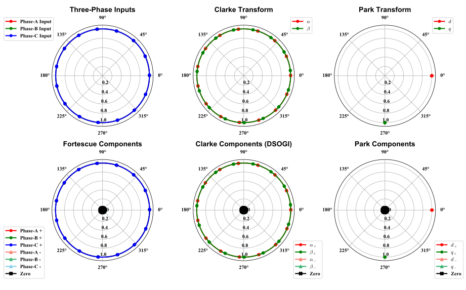

Preface
==================================================================================

Version
-------------------------------------------------------------------------------
Current version : 0.1.1

This version is largely complete.

Change Log
^^^^^^^^^^^^^^^^^^^^^^^^^^^^^^^^^^^^^^^^^^^^^^^^^^^^^^^^^^^^^^^^^^^^^^^^^^^^^
* Version 0.1.1
    * Improved documentation

Getting Started
-------------------------------------------------------------------------------
Type the following in your terminal:

.. code :: python

    python gsySymmMain.py

This should let Python to run the main script.

Or, you might need the following:

.. code :: python

    python3 gsySymmMain.py

Prerequisites
^^^^^^^^^^^^^^^^^^^^^^^^^^^^^^^^^^^^^^^^^^^^^^^^^^^^^^^^^^^^^^^^^^^^^^^^^^^^^
* **asteval**
* **csv**
* **Python 3.5+**
* **maplotlib**
* **numbers**
* **numpy**
* **PyQt5**
* **tkinter**
* **time**
* **os**
* **sys**
* **glob**

`Anaconda <https://www.anaconda.com/download/>`_ 5.0.1 should have everything.

I tried to make this project os independent, 
but since I only have a Windows machine, I have not been able to test it on any Linux systems.

Installing
^^^^^^^^^^^^^^^^^^^^^^^^^^^^^^^^^^^^^^^^^^^^^^^^^^^^^^^^^^^^^^^^^^^^^^^^^^^^^
You must install Python first. And then download the whole master trunk to your local machine.

Make sure you have the following file:

* **gsySymmMain.py** - this is the main script
* **gsySymmAbout.py** - this is "About" window script
* **gsySymmEquations.py** - this is the image for the equations
* **gsySymmIcon.py** - this is the image for the "About" window
* **gsyPlt.py** - custom library for plotting
* **gsyIO.py** - custom library for IO
* **gsyINI.py** - custom library for INI file manipulations

Other files are mainly for automatic documentation generation via Sphinx.

Here are two useful links for using sphinx:

* `Sphinx Autodoc Tutorial for Dummies <https://codeandchaos.wordpress.com/2012/07/30/sphinx-autodoc-tutorial-for-dummies/>`_

* `Adding Numpydoc to Sphinx <https://codeandchaos.wordpress.com/2012/08/09/sphinx-and-numpydoc/>`_

A detailed how to use can be found in the `documentation <./index.html>`_.

Built With
-------------------------------------------------------------------------------
* `Visual Studio Code <https://code.visualstudio.com/>`_ - The main development tool
* `Spyder <http://pythonhosted.org/spyder/>`_ - The secondary development tool
* `Anaconda <https://www.anaconda.com/download/>`_ - The Python distribution used
* `Sphinx <http://www.sphinx-doc.org/en/stable/>`_ - Used to automatically generate documentations
* `Read the Docs <https://github.com/rtfd/sphinx_rtd_theme>`_ - The theme for Sphinx
* Windows 7 - The OS environment

Preview
-------------------------------------------------------------------------------
**GUI:**

.. figure:: examples/exp01_inputfields.png
    :height: 426
    :width: 446.25
    :alt: The user interface

**Time-domain plots:**

.. figure:: examples/exp01_fig_time.svg

**Polar-domain plots:**

Contributing
-------------------------------------------------------------------------------
**高斯羽 博士** (**Dr. GAO, Siyu**)

This project is out of personal interest mainly.

Version Control
-------------------------------------------------------------------------------
I use the GitHub web app and the built-in Git function of VS Code.

License
-------------------------------------------------------------------------------
This project is licensed under Apache 2.0 License - see the "LICENSE.md" file for details. 
But I would really hate it if any one want to use any of my code for commercial gain.

Acknowledgments
-------------------------------------------------------------------------------
* Charles L. Fortescue
* Edith Clarke
* Robert H. Park

Special Thanks
-------------------------------------------------------------------------------
**王文元 博士** (**Dr. WANG, Wenyuan**)